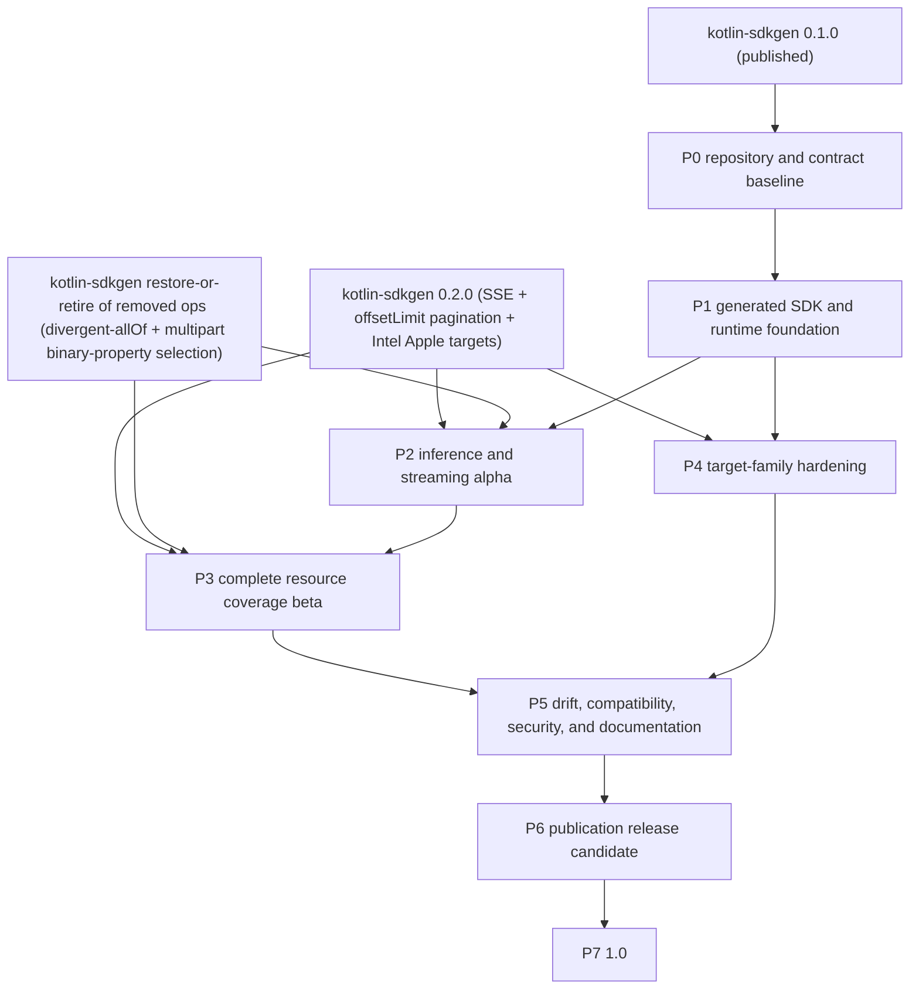
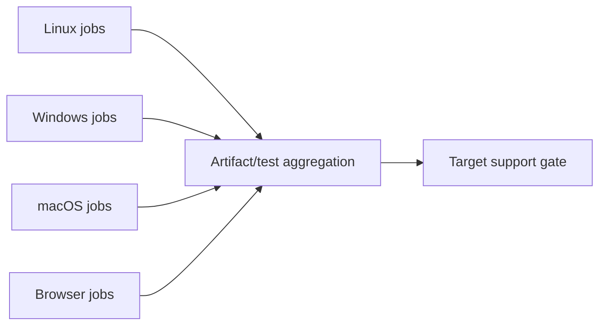
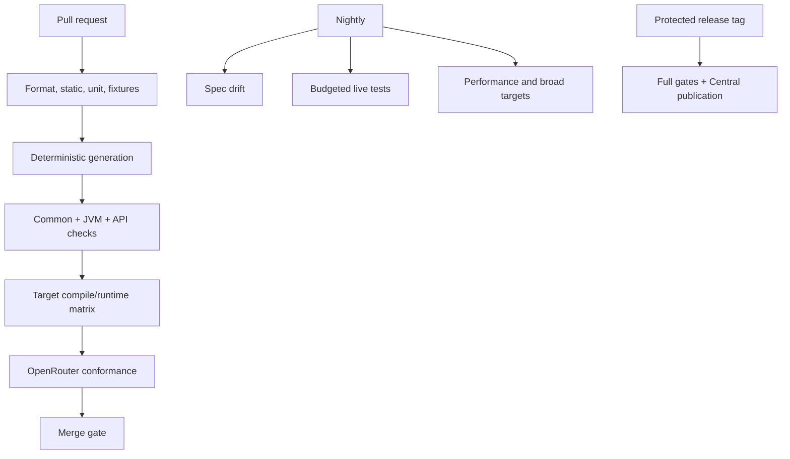

# OpenRouter Kotlin implementation plan

| Field | Value |
| --- | --- |
| Status | Approved planning baseline |
| Depends on | `kotlin-sdkgen` 0.1.0 (published 2026-08-14); streaming/pagination activation lands in 0.2.0 |
| Product target | `io.github.nabobery:openrouter-kotlin` 1.0 |
| Planning date | 2026-07-23 (dependencies and numbering updated 2026-08-17) |

## Outcome

Deliver a complete Kotlin Multiplatform OpenRouter client SDK with generated contract parity, a stable idiomatic Kotlin
surface, production streaming, safe resilience, automated schema drift, and Maven Central publication.

## Delivery principles

- Build vertical slices that compile on the target matrix.
- Treat public API contracts as design work, not generator residue.
- Add behavior through deep runtime modules rather than per-operation duplication.
- Use test-driven development for runtime behavior and golden/contract tests for generation.
- Keep generated changes mechanically reproducible.
- Do not stabilize a target or feature before its evidence gate passes.

## Dependency graph

Node numbers match the prose phase numbers below. `G1` is satisfied; `G2` covers the generator work that Phases 2–4
consume (SSE activation for OpenRouter, `offsetLimit` pagination, `iosX64`/`macosX64` runtime targets). `G3` gates
the parts of Phases 2–3 that need the three currently overlay-removed operations, and means "restore or formally
retire all removed operations." It has two distinct technical prerequisites: divergent-`allOf` composition support
(`/messages`, `/responses`) and multipart binary-property selection (`/audio/transcriptions`, whose generated
multipart codec currently hardcodes `request.file` where the schema declares `SttRequest.inputAudio`). Phase 2's
Responses/Messages exact generated APIs and Phase 3's 100%-retained-coverage exit gate wait on those features —
or a formal retained-inventory retirement decision. Phase 2 can ship its chat/images streaming deliverables on
`G2` alone.

## Phase 0 — Repository and contract baseline

### Deliverables

- Gradle/KMP repository scaffold and convention plugins.
- Version catalog and dependency verification.
- License (decided 2026-08-17: Apache-2.0, matching `kotlin-sdkgen`), contribution, security, and code-of-conduct
  policies.
- Pinned OpenRouter spec, provenance manifest, and initial operation inventory.
- `kotlin-sdkgen` plugin/CLI integration.
- Generated source isolation and deterministic regeneration command.
- Initial target-family compile matrix.
- API compatibility baselines.

### Tasks

1. Establish modules for SDK, testing, conformance, samples, and build logic.
2. Select Kotlin, Ktor, coroutines, serialization, Gradle, and publication versions.
3. Import the current canonical OpenRouter spec and verify digest.
4. Generate twice into clean directories and compare bytes.
5. Produce the list of resources, operations, stream modes, pagination modes, and errors.
6. Convert all unsupported generation diagnostics into blocking issues or explicit time-limited waivers.
7. Configure formatting, static analysis, explicit API, API validation, and documentation lint.

### Exit gate

- Clean clone can generate and compile the exact API without hand edits.
- Every omission is visible in an exception register.
- No secret or network access is needed for normal tests.

## Phase 1 — Generated SDK and runtime foundation

### Deliverables

- One `OpenRouter` root with generated resource clients.
- Ktor adapter and neutral transport injection.
- Static/dynamic credentials and trusted-host rules.
- Client defaults and per-request override model.
- Typed attribution, custom headers, reserved-header protection.
- Typed failures, response metadata, retry history, and deadlines.
- Testing artifact with fake transport and fixtures.

### Work streams

| Stream | Key acceptance |
| --- | --- |
| Client lifecycle | Thread-safe reuse and explicit ownership |
| Authentication | Per-attempt resolution, redaction, trusted hosts |
| Overrides | Inherit/replace/clear without nullable ambiguity |
| Transport | Caller Ktor client untouched; fake adapter passes same contract |
| Failures | Decoded typed errors and bounded unknown previews |
| Response access | Normal and `WithResponse` operations agree |
| Resilience | Replay-aware decisions, virtual-time deterministic tests |

### Exit gate

Representative non-streaming operations from inference and management resources pass through the complete lifecycle on
fake and Ktor transports.

## Phase 2 — Inference and streaming alpha

### Deliverables

- Chat, Responses, and Messages exact generated APIs.
- Curated request overloads and DSLs for high-frequency inference calls.
- Incremental SSE engine and generated dual response modes.
- Curated cold `Flow` event APIs.
- Stream-idle deadlines and cancellation ownership.
- JVM, Android, Apple, and JS sample consumers.

### Streaming TDD sequence

1. First event before response completion.
2. Arbitrary byte and UTF-8 chunking.
3. Comments, metadata, multiline fields, and `[DONE]`.
4. Typed in-band errors.
5. Non-2xx and malformed stream failures.
6. Cancellation before/after events.
7. Slow collector and bounded diagnostics.
8. Prove no retry after emission.

### Exit gate

- Alpha artifact can execute mock and opt-in live chat on Tier 1 families.
- Cancellation contract passes on every Tier 1 transport test host.
- Curated and exact calls serialize identical payloads for equivalent requests.

## Phase 3 — Complete resource coverage beta

### Deliverables

- Every retained OpenRouter operation.
- Pagination pages and item flows.
- Multipart, files, binary downloads, audio/video, and form bodies as required.
- Open enums, unknown unions, and presence-state fixtures.
- Generated beta namespace and curated experimental annotations.
- Complete operation coverage dashboard.

### Exit gate

- 100% retained operation coverage.
- No stable documented request field requires `Any`.
- All accepted waivers have a 1.0 disposition.
- Tier 1 and Tier 2 publications compile and resolve.

## Phase 4 — Target-family hardening

### Deliverables

- Final tier assignments for JVM, Android, Apple, Linux, Windows, JS, and Wasm.
- Target-specific sample consumers and engine documentation.
- Runtime tests on capable hosts.
- Artifact size, memory, first-event latency, and generated compile-time budgets.

### Matrix orchestration

### Exit gate

Every published target satisfies its documented tier; unavailable host tests are explicitly disclosed.

## Phase 5 — Drift, compatibility, security, and documentation

### Deliverables

- Daily digest-based drift PR workflow.
- Layered semantic/source/binary/behavior/target compatibility report.
- Official TypeScript/Python/Go parity matrix.
- Security threat model and secret-isolation report.
- Reference documentation generated from public API.
- Compiling tutorials/how-to guides and migration notes.

### Exit gate

One real upstream spec update completes fetch → generation → gates → reviewable PR with no source edits. Documentation
and code describe the same supported targets and defaults.

## Phase 6 — Publication release candidate

### Deliverables

- Root and target KMP publications.
- Primary and testing artifacts.
- POM metadata, sources, documentation, signatures, checksums.
- SBOM and provenance.
- Isolated Maven consumer matrix.
- Protected release workflow and rollback runbook.

### Exit gate

A release candidate validates in the Maven Central Portal and resolves in representative JVM, Android, Apple, Native,
and web consumers.

## Phase 7 — Version 1.0

### Required gates

- Complete pinned OpenRouter API parity.
- Stable curated API and reviewed generated API baseline.
- Declared target-family matrix fulfilled.
- Streaming, cancellation, retry, security, and ownership contracts passed.
- Drift and compatibility automation operational.
- No unowned 1.0 waiver.
- Maven Central release and post-publish verification successful.

## CI topology

## Work breakdown conventions

Each implementation task must contain:

- Requirement and ADR links.
- Public contract before implementation.
- Tests that fail for the intended reason.
- Platform/target impact.
- Compatibility classification.
- Security and observability considerations.
- Documentation/KDoc impact.
- Acceptance command and evidence.

## Definition of done

- Implementation and tests pass locally and in the applicable matrix.
- Generated files were produced, not hand-edited.
- Public API is documented and compatibility baseline updated.
- Cancellation, ownership, and secret behavior are tested.
- Examples compile.
- No new waiver without owner, rationale, expiry, and 1.0 disposition.
- Related product/design/reference documents remain consistent.

## Principal risks

| Risk | Mitigation |
| --- | --- |
| OpenRouter schema evolves during implementation | Daily drift reporting; pin releases; additive update discipline |
| “All targets” destabilizes CI | Tiered matrix, host-specific aggregation, promotion evidence |
| Curated API forks generated models | Shared immutable types and serialization golden tests |
| Retrying inference duplicates spend | Replay/delivery-aware policy and conservative defaults |
| Engine differences leak into common API | Neutral transport seam and capability reporting |
| Generated public API churn | Compatibility report, deterministic naming, curated stability |
| Release complexity produces partial publications | Isolated rehearsal and one-version/root-publication checks |

## External dependencies

Updated 2026-08-17. `kotlin-sdkgen` 0.1.0 is published: Maven Central group `io.github.nabobery` (engine, runtime,
CLI, Gradle plugin, and per-target runtime artifacts) and Gradle Plugin Portal plugin `io.github.nabobery.kotlin-sdkgen`.
Phase 0 consumes these published coordinates directly; no composite build or vendoring is required, though a composite
build remains available for testing unreleased generator features.

Remaining generator work this plan depends on, targeted at `kotlin-sdkgen` 0.2.0:

- SSE streaming activation for the OpenRouter spec (overlay-injected `x-sdkgen-streaming`; the capability itself is
  built and fixture-proven) — needed by Phase 2.
- An `offsetLimit` pagination style (16 of OpenRouter's 17 paginated operations use it; only `cursor` and
  `headerNextUrl` exist in 0.1.0) — needed by Phase 3.
- `iosX64` and `macosX64` runtime targets (0.1.0 ships arm64-only Apple targets) — needed by Phase 4's Tier 1 matrix.
- Restoration of the 3 removed operations (`G3`; 3 of 89): divergent-`allOf` composition for `/messages` +
  `/responses`, and multipart binary-property selection for `/audio/transcriptions` — needed by Phase 2's
  Responses/Messages exact-API deliverable and Phase 3's 100%-coverage gate, unless those operations are
  formally retired from the retained inventory (a product decision that weakens the parity goal and would need
  PRD/ADR amendment).
- HTTPS spec acquisition — Phase 5's drift workflow fetches with `curl` plus digest verification until it exists.

OpenRouter Kotlin should consume these capabilities rather than reimplement them.

