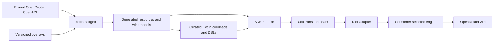
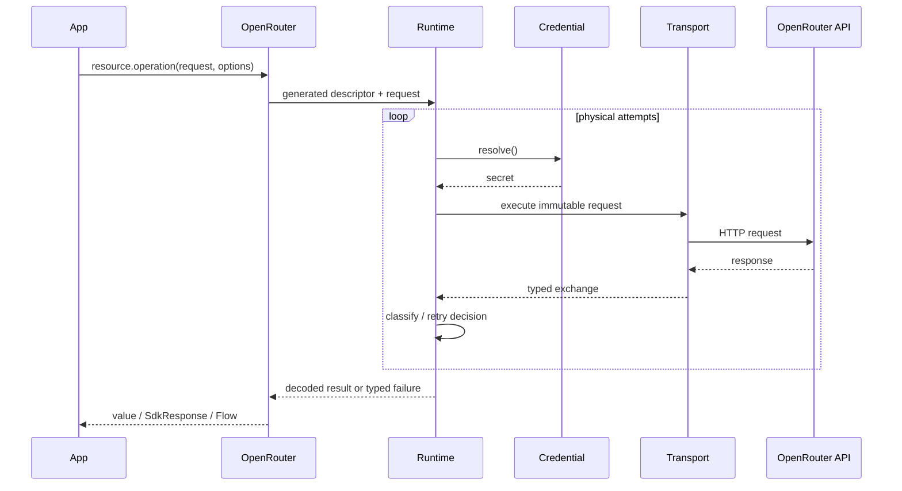
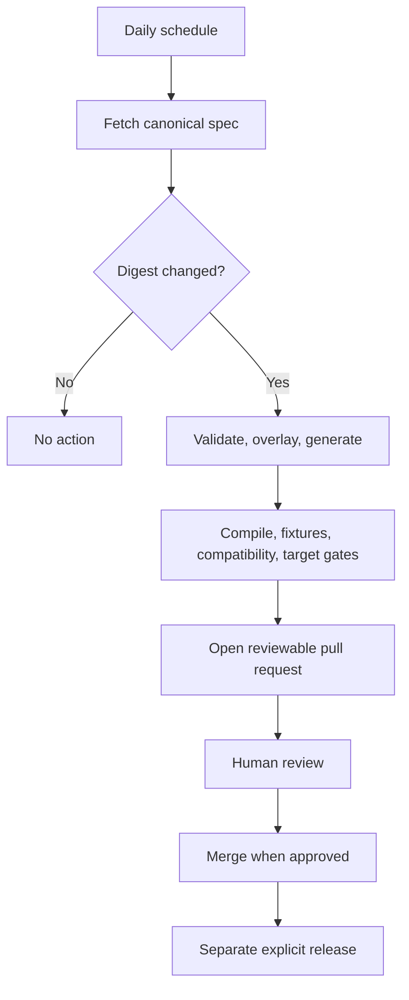

# OpenRouter Kotlin product requirements

| Field | Value |
| --- | --- |
| Product | OpenRouter Kotlin |
| Repository | `nabobery/openrouter-kotlin` |
| Status | Approved for implementation |
| Maven group | `io.github.nabobery` (see ADR 0006 amendment) |
| Primary artifact | `openrouter-kotlin` |
| License | Apache-2.0 |
| Last updated | 2026-08-17 |
| Related design | [System design](./system-design.md) |

## 1. Product overview

OpenRouter Kotlin is an independent, community-maintained Kotlin Multiplatform client SDK for the OpenRouter API. It
combines a complete API generated from OpenRouter's OpenAPI contract with an idiomatic Kotlin surface built around
immutable models, suspend functions, cold `Flow` streams, structured cancellation, typed failures, and optional DSLs.

The product is a thin client SDK. Applications retain control of prompts, conversation state, tool execution,
orchestration, persistence, and user interfaces.

### Vision

Make OpenRouter a first-class Kotlin API: as complete and current as the official SDKs, portable across meaningful KMP
targets, and natural for Kotlin developers to use.

### Product principles

- **Contract fidelity:** exact wire behavior comes before language-level imitation.
- **Complete coverage:** consumers should not need a second HTTP client for documented OpenRouter operations.
- **Progressive usability:** simple calls are concise; advanced calls preserve full control.
- **Forward compatibility:** unknown enum values and extensible JSON survive schema evolution.
- **Safe cost behavior:** cancellation and retry defaults avoid unintended duplicate inference.
- **Multiplatform honesty:** every target has an explicit support tier and evidence.
- **Reproducibility:** a pinned spec, overlays, generator version, and tests reproduce each release.
- **One-version rule:** resource packages ship together under one SDK version.

## 2. Problem statement

Kotlin users can call OpenRouter with raw Ktor, generic OpenAI clients, or small JVM wrappers, but these choices leave
material gaps:

- OpenRouter-specific routing, fallback, ZDR, reasoning, plugin, usage, cost, management, and experimental fields are
  missing or untyped.
- OpenAI-compatible clients cover only a subset of the OpenRouter platform.
- Retrofit-style clients are JVM/Android-oriented and do not solve common KMP transport or SSE behavior.
- Handwritten models drift as OpenRouter changes rapidly.
- Stock OpenAPI generation struggles with OpenRouter's unions, open enums, optional/null semantics, and stream shapes.
- Naive SSE clients buffer entire responses, mishandle comments or `[DONE]`, or fail to cancel underlying I/O.
- General retry middleware can replay billable POST requests after ambiguous delivery.

OpenRouter's official TypeScript, Python, and Go SDKs provide thin, generated, type-safe clients. Kotlin needs comparable
wire and endpoint parity plus Kotlin-specific coroutine and multiplatform behavior.

## 3. Goals and success metrics

### Goals

1. Reach complete operation and schema coverage for the pinned OpenRouter contract by 1.0.
2. Support the actively maintained, materially useful KMP target families from the first public release.
3. Offer both exact generated access and a stable, idiomatic Kotlin experience.
4. Provide production-grade incremental streaming and structured cancellation.
5. Track upstream changes automatically without automatically publishing them.
6. Publish trustworthy artifacts to Maven Central.
7. Maintain measurable behavioral parity with official OpenRouter SDKs.

### Non-goals

- An agent framework or automatic tool loop.
- A hosted proxy, credential store, cache, analytics service, or UI toolkit.
- Source-level imitation of TypeScript, Python, or Go.
- Bundling a preferred Ktor engine for each target.
- Multiple built-in transport families in 1.0.
- Guaranteeing the behavior of model providers beyond OpenRouter's contract.
- Automatic merge or release from a schema update.

### Success metrics

| Metric | 1.0 target | Evidence |
| --- | --- | --- |
| Operation coverage | 100% of retained pinned operations | Generated inventory and exception register |
| Schema coverage | All referenced request, success, and documented error schemas | Generation and target compilation |
| Stable OpenRouter typing | No documented stable field requires `Any` or an untyped map | API audit |
| Drift detection | Upstream change reported within 24 hours | Scheduled workflow |
| Determinism | Same inputs produce a byte-identical generated tree | Clean regeneration gate |
| Streaming latency | First fixture event emitted before response completion | Streaming contract test |
| Cancellation | Collector cancellation closes underlying exchange | Transport contract tests |
| Secret safety | No credential in exceptions, logs, hooks, or snapshots | Redaction suite |
| Compatibility | No unclassified source, binary, semantic, or behavior change | Compatibility report |
| Target health | Every published target meets its declared tier | Target matrix |
| Publication | Root and target artifacts validate and resolve from an isolated consumer | Central rehearsal |
| Onboarding | First chat request in under ten minutes after stable quickstart exists | Usability test |

## 4. User personas

| Persona | Needs |
| --- | --- |
| Kotlin backend engineer | Typed inference and management APIs, configurable resilience, observability, stable JVM artifact |
| Android engineer | Lifecycle-safe streaming, consumer-controlled engine, small and predictable dependencies |
| KMP application engineer | One common API for Android, Apple, desktop, web, and server targets |
| SDK/platform engineer | Exact coverage, escape hatches, transport injection, compatibility reports, deterministic fixtures |
| Open-source contributor | Clear generated/curated ownership, reproducible workflows, actionable diagnostics |
| Release maintainer | Target-aware CI, signed Central publications, provenance, rollback and drift procedures |

## 5. User stories

| ID | Story | Priority |
| --- | --- | --- |
| US-001 | Configure one reusable client and send a typed chat request with a suspend function | Must |
| US-002 | Collect a cold flow of stream events and cancel it through structured concurrency | Must |
| US-003 | Configure provider routing, fallbacks, ZDR, data policy, reasoning, plugins, and tools with types | Must |
| US-004 | Access every operation in the pinned OpenRouter contract | Must for 1.0 |
| US-005 | Use the same public API from all published target families | Must |
| US-006 | Receive structured failures with status, request ID, code, decoded body, retry history, and cause | Must |
| US-007 | Control retries without silently duplicating inference spend | Must |
| US-008 | Supply a Ktor client or a neutral transport | Must |
| US-009 | Use new server fields safely before the next release through controlled JSON escape hatches | Must |
| US-010 | Override credentials, attribution, headers, deadlines, and retries per request | Should |
| US-011 | Iterate collection endpoints manually by page or automatically as `Flow` | Should |
| US-012 | Construct the same immutable request with a constructor or optional Kotlin DSL | Should |
| US-013 | Test applications with fixtures and a fake transport without network access | Should |
| US-101 | Review a tested pull request when the OpenRouter spec changes | Must |
| US-102 | Classify upstream changes before release | Must |
| US-103 | Publish all target variants once under one version | Must |

## 6. Core features and functional requirements

### 6.1 Client and configuration

| ID | Requirement |
| --- | --- |
| FR-CLI-001 | Provide one thread-safe, reusable `OpenRouter` client root with resource properties. |
| FR-CLI-002 | Support static and suspend dynamic credential providers evaluated for each physical attempt. |
| FR-CLI-003 | Provide explicit `fromEnvironment()` only on supported server/desktop targets. |
| FR-CLI-004 | Support typed attribution defaults and per-request inherit, replace, and clear behavior. |
| FR-CLI-005 | Support generic request headers with reserved authentication, content, and SDK header protection. |
| FR-CLI-006 | Support per-request credential overrides without mutating the client. |
| FR-CLI-007 | Make caller-owned versus SDK-owned resources explicit; close only owned resources. |
| FR-CLI-008 | Validate invalid base URLs, deadlines, retry settings, and blank credentials before I/O. |

### 6.2 Generated and curated APIs

| ID | Requirement |
| --- | --- |
| FR-API-001 | Generate a public operation for every retained OpenAPI operation. |
| FR-API-002 | Organize generated operations into discoverable resource clients under one root. |
| FR-API-003 | Add curated overloads only where they reduce routine complexity or provide Kotlin semantics. |
| FR-API-004 | Reuse the same immutable public request/response models in generated calls, overloads, and DSLs. |
| FR-API-005 | Provide typed normal calls and `WithResponse` alternatives exposing status and headers. |
| FR-API-006 | Put generated beta resources under `client.beta`; mark curated unstable APIs with Kotlin opt-in annotations. |
| FR-API-007 | Preserve unknown enum and union variants and their raw values. |
| FR-API-008 | Preserve absent, explicit-null, and present states where the contract distinguishes them. |
| FR-API-009 | Use `JsonElement`/`JsonObject`, never `Any`, for open JSON. |
| FR-API-010 | Keep Java interop reasonable without duplicating synchronous and asynchronous clients. |

### 6.3 Endpoint coverage

The pinned specification owns the exact inventory. Required capability families include:

- Chat, Responses, Messages, embeddings, rerank, image, audio, speech-to-text, and video inference.
- Models, providers, endpoints, routing data, presets, and ZDR-related discovery.
- Credits, generations, feedback, usage, analytics, observability, and benchmarks.
- Keys, organizations, workspaces, BYOK credentials, guardrails, files, and datasets.
- Stable and beta resources present in the release contract.

Every omitted operation requires an owner, reason, user impact, workaround, and 1.0 disposition.

### 6.4 Streaming

| ID | Requirement |
| --- | --- |
| FR-STR-001 | Curated streams return cold `Flow`; each collection starts one request. |
| FR-STR-002 | Parse SSE incrementally without `bodyAsText()` or full-body buffering. |
| FR-STR-003 | Support comments, multiline data, IDs, retry fields, arbitrary chunk boundaries, and `[DONE]`. |
| FR-STR-004 | Preserve exact stream payload variants; curated events may normalize framing but not discard fields. |
| FR-STR-005 | Represent valid in-band error events as typed values. |
| FR-STR-006 | Throw typed exceptions for connection, status, decoding, protocol, and unexpected termination failures. |
| FR-STR-007 | Cancelling or short-circuiting collection closes the response and transport exchange. |
| FR-STR-008 | Keep failure diagnostics bounded; never retain an unbounded stream. |
| FR-STR-009 | Never automatically restart a stream after an event has been emitted. |

### 6.5 Failures, retries, and deadlines

| ID | Requirement |
| --- | --- |
| FR-RES-001 | Use one documented typed exception hierarchy for terminal failures. |
| FR-RES-002 | Attach safe status, headers, request ID, operation ID, decoded error, retry history, and cause where available. |
| FR-RES-003 | Preserve `CancellationException` identity. |
| FR-RES-004 | Classify body replayability as no body, immutable bytes, replay factory, or one-shot. |
| FR-RES-005 | Consider delivery and response-consumption evidence before retrying. |
| FR-RES-006 | Honor `Retry-After` and `retry-after-ms` within caller deadlines and retry budgets. |
| FR-RES-007 | Provide client and per-request retry policies; defaults are conservative for billable POSTs. |
| FR-RES-008 | Support total logical-call, physical-attempt, and stream-idle deadlines. |
| FR-RES-009 | Leave engine-specific connect/socket timeout configuration to the supplied Ktor client. |

### 6.6 Pagination and response metadata

- Return the first typed page directly.
- Expose explicit next-page navigation.
- Expose bounded page and item flows.
- Preserve cursor/link metadata without assuming one pagination style.
- Protect authorization when following next links by applying trusted-host policy.
- Expose response status, headers, request ID, and typed result through `WithResponse`.

### 6.7 Transport and dependency injection

- Accept a consumer-configured Ktor `HttpClient`.
- Do not bundle target engine dependencies.
- Accept neutral `SdkTransport` injection for advanced adapters and tests.
- Keep transport types out of generated endpoint signatures.
- Support construction from DI containers through ordinary factories; do not depend on Hilt, Koin, or another container.
- Publish testing fixtures and a deterministic fake transport separately.

### 6.8 Observability

- No logging, metrics, or telemetry by default.
- Opt-in logical-call and physical-attempt hooks receive immutable, redacted events.
- Credential and sensitive-header values are never observable.
- Bodies are excluded by default and may only be exposed through explicit bounded/redacted policies.
- Hook failures cannot change request behavior unless the hook is explicitly middleware.

## 7. Non-functional requirements

| Area | Requirement |
| --- | --- |
| Portability | Common public code is platform-neutral and compiles for every published target |
| Concurrency | Client operations are safe for concurrent use; mutable request state is not shared |
| Memory | Streaming and downloads are incremental; diagnostic buffers are bounded |
| Performance | Runtime overhead is measured against raw transport; generated scale stays within CI budgets |
| Reliability | Deterministic generation, bounded resilience, explicit ownership, and cancellation correctness |
| Compatibility | Source, binary, semantic, behavior, and target changes are independently classified |
| Security | Secrets denied by default, reserved headers protected, dependencies and artifacts verified |
| Maintainability | Generated, curated, runtime, and build concerns have explicit ownership and seams |
| Documentation | Every public stable symbol has KDoc; every release has migration notes and a support matrix |
| Accessibility | Documentation examples use readable terminology and do not rely only on color or images |

## 8. System architecture overview



See [system design](./system-design.md) for module and lifecycle detail.

## 9. Data models and entities

| Entity | Responsibility |
| --- | --- |
| `OpenRouter` | Reusable client root and resource discovery |
| `OpenRouterConfig` | Immutable client defaults and ownership |
| `RequestOptions` | Per-call credentials, headers, attribution, deadlines, retries, and hooks |
| `CredentialProvider` | Suspend credential resolution per physical attempt |
| `Attribution` / override | Typed application identity and inherit/replace/clear semantics |
| Generated request/response | Exact contract projections |
| `FieldState<T>` | Absent/null/value preservation where required |
| Open enum/union | Known variants plus raw-preserving unknown variant |
| `SdkResponse<T>` | Typed value plus safe HTTP metadata |
| `SdkException` hierarchy | Terminal failure contract |
| `Page<T>` | Items and next-page metadata |
| Stream event hierarchy | Exact/curated incremental events |

## 10. API design

Representative shape, subject to compile-validated design:

```kotlin
val client = OpenRouter(
    credential = CredentialProvider.static(apiKey),
    httpClient = httpClient,
    attribution = Attribution(
        referer = "https://example.com",
        title = "Example",
    ),
)

val response = client.chat.send(
    model = "openai/gpt-5.2",
    messages = listOf(UserMessage("Explain structured concurrency.")),
)

client.chat.stream(request).collect { event ->
    when (event) {
        is ChatStreamEvent.Chunk -> render(event.value)
        is ChatStreamEvent.Error -> showProtocolError(event.value)
        ChatStreamEvent.Done -> Unit
    }
}
```

The normative API contract is [public API design](./public-api-design.md).

## 11. User flows

### Request flow



### Spec update flow



## 12. Edge cases and failure handling

- Unknown enum and discriminator values.
- Field omitted versus explicitly null.
- Empty and multiline SSE messages; comments and metadata-only events.
- UTF-8 split across transport chunks.
- Cancellation before headers, during decoding, between events, and during cleanup.
- Dynamic credentials failing or rotating between retries.
- One-shot bodies with retryable statuses.
- Redirect or pagination link to an untrusted host.
- `Retry-After` exceeding total deadline.
- Success status with malformed content type or body.
- Error status with malformed, empty, binary, or extremely large body.
- Unknown status codes and newly added response variants.
- Consumer closes an owned client while calls are active.
- Unsupported transport capability on a target.
- Schema drift that adds, removes, or reinterprets a public declaration.

Each case requires a deterministic fixture before the responsible feature can be stable.

## 13. Security and privacy

The SDK processes API keys and potentially sensitive prompts. It must:

- Never log or stringify secrets.
- Prevent generic headers from overriding authentication and protected protocol headers.
- Apply credentials only to trusted hosts.
- Redact diagnostics before invoking observers.
- Avoid persistent prompt/response storage.
- Use dependency verification, locked versions, signed artifacts, SBOM, and provenance.
- Treat external responses, spec files, and pagination URLs as untrusted input.

See [security and privacy](./security-and-privacy.md).

## 14. Dependencies and assumptions

### Dependencies

- OpenRouter OpenAPI and documented server behavior.
- `kotlin-sdkgen` generator and runtime artifacts.
- Kotlin, Kotlin Multiplatform Gradle plugin, `kotlinx.serialization`, and `kotlinx.coroutines`.
- Ktor client core and consumer-selected engines.
- Gradle publication, API compatibility, signing, SBOM, and provenance tooling.
- GitHub Actions and Maven Central Portal.

### Assumptions

- OpenRouter continues publishing an OpenAPI document.
- Official SDKs remain useful behavioral comparators.
- `kotlin-sdkgen` 0.1.0 is published (Maven Central `io.github.nabobery`, Gradle Plugin Portal); streaming and
  pagination activation for OpenRouter land in its 0.2.0 before this SDK's inference alpha and coverage beta.
- Consumers accept adding a Ktor engine appropriate for each target.
- All-KMP support uses tiers; it does not imply identical runtime testing on every target.

## 15. Milestones

Phase numbers match the implementation plan's Phases 0–7.

| Phase | Outcome |
| --- | --- |
| 0 — Repository and contract baseline | Scaffold, pin spec, generate inventory, freeze decisions, compatibility baseline |
| 1 — Generated SDK and runtime foundation | Client root, configuration, credentials, headers, failures, transport wiring |
| 2 — Inference and streaming alpha | Chat/Responses/Messages, streaming, cancellation, retries, first samples |
| 3 — Complete resource coverage beta | Every retained resource, pagination, binary/multipart, presence-state fixtures |
| 4 — Target-family hardening | Final tier assignments, per-target samples and runtime tests, budgets |
| 5 — Drift, compatibility, security, docs | Drift PRs, compatibility reports, threat model, reference docs |
| 6 — Publication release candidate | Full publication set, isolated consumer matrix, Central rehearsal |
| 7 — 1.0 | Complete parity, stable curated API, declared target matrix, Maven Central release |

Detailed tasks and dependencies are in the [implementation plan](./plans/2026-07-23-openrouter-kotlin-implementation-plan.md).

## 16. Open questions

These questions do not block initial implementation:

- Contributor governance (license is decided: Apache-2.0).
- Exact target promotion thresholds after real consumer feedback.
- Whether an agent SDK should become a separate future repository.
- Whether usage justifies additional convenience artifacts after 1.0.
- Which beta OpenRouter features merit curated overloads versus generated-only exposure.

## References

- [OpenRouter client SDK overview](https://openrouter.ai/docs/client-sdks/overview)
- [OpenRouter API reference and OpenAPI links](https://openrouter.ai/docs/api/reference/overview)
- [OpenRouter TypeScript SDK](https://github.com/OpenRouterTeam/typescript-sdk)
- [OpenRouter Python SDK](https://github.com/OpenRouterTeam/python-sdk)
- [OpenRouter Go SDK](https://github.com/OpenRouterTeam/go-sdk)
- [Ktor client SSE](https://ktor.io/docs/client-server-sent-events.html)
- [Kotlin Flow API](https://kotlinlang.org/api/kotlinx.coroutines/kotlinx-coroutines-core/kotlinx.coroutines.flow/-flow/)
- [KMP library publication](https://kotlinlang.org/docs/multiplatform-publish-lib.html)

