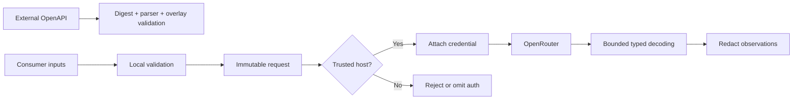

# Security and privacy

See also the full [STRIDE threat model](security/threat-model.md) (per-boundary controls with evidence and
residuals) and the [secret-isolation report](security/secret-isolation-report.md) (a CI-checked, generated table
of every workflow's permissions and secret usage).

## Assets and threats

| Asset | Threat |
| --- | --- |
| API credentials | Logging, exception leakage, forwarding to an untrusted host |
| Prompts and outputs | Accidental telemetry, unbounded error capture, test artifacts |
| Attribution metadata | Incorrect inheritance or unexpected disclosure |
| Build inputs | Compromised spec, dependency, plugin, or generated source |
| Published artifacts | Tampering, wrong coordinates, unsigned or unreproducible release |

## Trust model

## Credential requirements

- Store credential values in a redacting `Secret` abstraction.
- Resolve dynamic credentials once per physical attempt.
- Never include secret values in equality diagnostics, `toString`, exception messages, test snapshots, or observers.
- Apply credentials only after trusted-host validation.
- Clear references as soon as practical; do not claim guaranteed memory erasure on managed runtimes.
- Environment lookup is explicit and restricted to appropriate targets.
- Per-request credentials inherit all host and redaction protections.

## Header safety

Generic header injection is an escape hatch. Protect, case-insensitively:

- `Authorization`.
- `Host`.
- `Content-Length`.
- SDK-controlled content type/accept headers.
- SDK user-agent/version headers where overriding would break diagnostics.

Typed attribution is separate from generic headers and supports inherit, replace, and clear.

## Redirects and pagination

Redirects and absolute next-page URLs are untrusted input. Default behavior must never forward authentication outside
the configured trusted-host set. Scheme downgrade is rejected. Host comparison uses parsed normalized URLs, not string
prefixes.

## Logging and observability

There is no logging or telemetry by default. Opt-in observations:

- Exclude bodies and credentials by default.
- Use allowlisted metadata rather than denylisting known secrets.
- Bound string, header, and body previews.
- Distinguish logical calls from physical attempts.
- Do not let observer failure change request results.
- The curated `TransferObserver` (per-call `options { transferObserver(...) }`) reports **byte counts only**
  (`direction`, `bytesTransferred`, `totalBytes`) — never the transferred bytes themselves — for upload/download
  progress on the multipart and binary media operations.

## Binary bodies

- `readAllBytes(maxBytes)` and the curated `downloadBytes(...)` are **bounded** — a payload exceeding `maxBytes`
  throws `SdkBufferLimitExceededException` and the stream is closed, so a hostile or mis-sized response cannot
  exhaust memory. The default bound is 64 MiB (`DEFAULT_MAX_DOWNLOAD_BYTES`); use `downloadFileContent(...).asFlow()`
  to stream large files without buffering. Byte streams are one-shot and always closed with their close-cause.

Debug facilities must carry explicit warnings and remain safe enough that enabling them does not reveal API keys.

## Response handling

Treat all remote data as untrusted:

- Select response alternatives by status and normalized content type.
- Bound unknown-body previews.
- Validate pagination URLs.
- Preserve raw unknown JSON without executing or interpreting it.
- Do not place server error text into logs without redaction and bounds.
- Close bodies exactly once.

## Streaming privacy

Streaming diagnostics retain only a bounded trailing window of already processed data. No facility records a complete
prompt or response by default. Cancellation immediately stops further consumption.

## Supply-chain controls

| Control | Status | Where |
| --- | --- | --- |
| Spec pinned by SHA-256; generator/plugin versions pinned | implemented | `spec/pin.json`, `spec/sdkgen.yaml`, `gradle/libs.versions.toml` |
| Overlays digest-pinned; generated diff reviewed via the drift PR | implemented | `spec/sdkgen.yaml`, `.github/workflows/drift.yml` |
| Gradle dependency verification (PGP trusted keys; checksum fallback for unsigned artifacts) | planned | not yet configured |
| npm/yarn lock for the JS target | implemented | `kotlin-js-store/yarn.lock` |
| Secret scanning (gitleaks: PR/push + weekly history) | implemented | `.github/workflows/gitleaks.yml`, `.gitleaks.toml` |
| Dependency vulnerability review on PRs (fail on high) | implemented | `.github/workflows/dependency-review.yml` |
| OpenSSF Scorecard (weekly + push) | implemented | `.github/workflows/scorecard.yml` |
| CodeQL (Kotlin/Java, weekly, 90-min cap) | implemented | `.github/workflows/codeql.yml` |
| Dependabot (Gradle + Actions, weekly) | implemented | `.github/dependabot.yml` |
| Workflow SHA pins + least privilege + secret isolation, machine-checked | implemented | `scripts/workflow-audit.py`, `docs/security/secret-isolation-report.md` |
| GitHub native secret scanning + push protection | operator action | repository settings |
| SBOM (CycloneDX) | planned | future release work |
| Signed Maven publications; build provenance/attestation | planned | future release work |
| Publish only from protected workflows and immutable tags; drift/release permission separation | planned/partial | `docs/spec-sync-and-release.md` |

## CI permissions

Default workflow permission is `contents: read`. Drift creation receives narrow pull-request/content write permission
through a GitHub App or fine-grained token. Release credentials are available only to the protected release environment.
Pull requests from forks never receive secrets.

## Data handling statement

The SDK is a local client library:

- It does not operate a backend.
- It does not persist prompts, responses, or credentials.
- It sends caller-provided data to the configured OpenRouter endpoint.
- Observability callbacks execute inside the consumer application.

Documentation must not imply that selecting ZDR or provider data policies guarantees behavior beyond OpenRouter's
documented server contract.

## Incident response

The reporting channel and the seven-step incident procedure live in [SECURITY.md](../SECURITY.md) (private
reporting via GitHub Security Advisories, supported versions, and the response steps).
