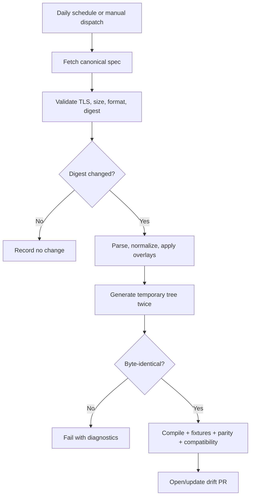
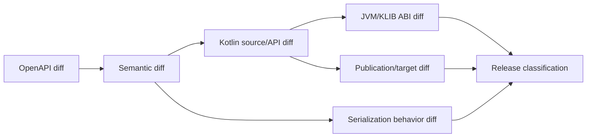

# Specification synchronization and release

## Inputs

Each generated state records:

```json
{
  "source": "https://openrouter.ai/openapi.yaml",
  "sha256": "<digest>",
  "retrievedAt": "<UTC timestamp>",
  "generator": "io.github.nabobery:kotlin-sdkgen:<version>",
  "overlayDigest": "<digest>"
}
```

Network access is not required for ordinary tests. CI tests use pinned inputs.

## Drift workflow



The PR includes source provenance, semantic summary, operation inventory, generated diff, compatibility classifications,
target results, official-SDK comparison, and overlay changes. It does not publish.

### Implementation (`.github/workflows/drift.yml`)

The workflow runs **daily at 05:41 UTC** (and on manual dispatch) through a strict **privilege split**, so a
compromised regeneration can never obtain write access:

- **`detect`** — unprivileged (`contents: read`, **no secrets**), on macOS so `apiDump` refreshes the klib ABI for
  every target. It runs `scripts/drift-refresh.sh` (fetch → compare → re-pin → regenerate twice for determinism →
  re-baseline dumps/dashboards), then the gates and the compatibility report, and uploads a **data-only** artifact: a
  git **patch** plus a Markdown **report** (and, on a block, the generator diagnostics). It executes code, but produces
  only data.
- **`open-pr`** — the only write-capable job (`contents: write`, `pull-requests: write`). It **executes nothing from
  the artifact**: it validates the patch structurally with the repo-owned `scripts/validate-drift-patch.py` (allowlisted
  paths only; no binary hunks; no rename/mode/type changes; regular `100644` files only), applies it to a **temporary
  git index**, re-checks that every touched entry is a regular non-executable file, and only then checks it out and
  opens/updates the PR. Ordinary PR CI (unprivileged) re-validates the result — but the structural validation and
  temporary-index apply are the preventive control, not PR CI.

`scripts/drift-refresh.sh` reports three outcomes, which map to the PR:

| Exit | Status | Outcome |
| --- | --- | --- |
| 0 | `no-change` | Upstream digest matches the pin — nothing happens. |
| 10 | `rebaselined` | Upstream changed and fully re-baselined — a normal PR (labels `automation`, `drift`). |
| 20 | `blocked` | Upstream changed but generation failed (e.g. an additive change disturbed an audited overlay digest) — a **draft** PR (label `drift:blocked`) carrying the spec re-pin **only** plus the diagnostics report, so a human triages the overlay exactly as a manual re-pin would. |

A `workflow_dispatch` **`rehearse_from_ref`** input runs the whole pipeline inside a throwaway `git worktree` created
from that ref (e.g. an old, narrower pin) so the end-to-end path — including the `blocked` draft-PR path — can be
exercised even when upstream is quiet, without touching the checkout.

### Operator setup (one-time; not created by automation)

1. **Settings → Actions → General → Workflow permissions:** enable *"Allow GitHub Actions to create and approve pull
   requests"* (otherwise the drift PR cannot be opened with the default token).
2. **Optional GitHub App** for unattended CI on the drift PR (without it, a maintainer clicks *"Approve workflows to
   run"* on each drift PR): create an App with **Contents: Read & write** and **Pull requests: Read & write**, install
   it on this repo, then store `DRIFT_APP_CLIENT_ID` as a repository **variable** and `DRIFT_APP_PRIVATE_KEY` as a
   repository **secret**.
3. **Labels:** `automation`, `drift`, `drift:blocked`, `compat:breaking`.
4. **Branch protection** on `main` requiring the `CI` checks so a drift PR cannot merge without a green run.

## Overlay governance

Every overlay includes:

- Stable identifier.
- Upstream source identity.
- Reason and linked evidence.
- Expected semantic effect.
- Fixture or conformance test.
- Owner and removal condition.

Unused, overlapping, or stale overlays fail validation. An overlay may repair generation metadata but must not quietly
invent server behavior.

### Overlay inventory

Two overlays are pinned in [`spec/sdkgen.yaml`](../spec/sdkgen.yaml) (each with an `id`, `uri`, and `sha256`) and
applied in declaration order:

| Id | File | Purpose | Removal condition |
| --- | --- | --- | --- |
| `openrouter-allof-resolution-audit` | `spec/overlays/allof-resolution-audit.yaml` | Audited `x-sdkgen-allof-resolution` overrides that select the refined protocol-specific `allOf` branch for object-merge conflicts (`/messages`, `/responses`). Re-audited to v1.1.0 for the 2026-08-29 re-pin (Responses GA reshaping drifted nine content digests). **Re-audited to `info.version` 1.2.0 for the 2026-08-30 additive-cosine re-pin** — the new `usage.source` `cosine` property re-derived the `MessagesResult` branch digest (`f86b9036…`), taken mechanically from the generator's diagnostic. | kotlin-sdkgen resolves divergent-`allOf` composition without per-property audit hints. |
| `openrouter-full-spec-compat` | `spec/overlays/full-spec-compat.yaml` | StandardProjection compatibility: removes the `/embeddings` and `/rerank` `text/event-stream` nodes and stamps `x-sdkgen-streaming` metadata on the real streaming paths. Each streaming block declares **`payloadProperty: data`** (v2.1.0, 2026-08-30), so kotlin-sdkgen 0.4.0 projects each SSE `data:` field to the envelope's payload type natively — this retired the separate `sse-payload.yaml` overlay. **The `/files` `x-sdkgen-pagination` block was removed at the 2026-08-29 re-pin** (`FileListResponse` became a discriminated `oneOf` the generator cannot paginate). | kotlin-sdkgen infers SSE payloads without the `payloadProperty` hint, or OpenRouter stops describing envelopes; and paginates over discriminated response envelopes. |

### Re-pin log

| Date | From → To (sha256) | Ops | Notes |
| --- | --- | --- | --- |
| 2026-08-29 | `b901d462…` → `b2a4948a…` | 89 → 101 (+12) | First controlled re-pin from the pinned corpus digest to the live upstream contract via `scripts/fetch-upstream-spec.sh`. Responses **and** Analytics GA'd (both `beta.*` tags removed; `BetaResponsesClient`→`ResponsesClient`, `BetaAnalyticsClient` folded into `AnalyticsClient`). New resources: containers (×4), SCIM (×5), `getSessionCost`, `getWorkspaceBudget`. `FileListResponse`/`FileResponse` became `_shape`-discriminated unions. Generated 100/101 operations; one accepted waiver (`deleteScimGroupMapping`). Audit overlay re-audited to v1.1.0. See `docs/coverage/exception-register.md`. |
| 2026-08-30 | `b2a4948a…` → `e88b0cec…` | 101 → 101 (0) | Additive upstream change re-pinned end-to-end via `scripts/drift-refresh.sh`: a new `cosine` object property on the `usage.source` inline schema plus `cosine`/`Cosine` enum values (and a `category` enum reorder). The additive property re-derived the `MessagesResult.usage.source` audited allOf digest, so the audit overlay was re-audited (`info.version` 1.2.0; `inlineSchemaSha256` `c5634ea6…`→`f86b9036…`) and its own digest re-synced — a spec-maintenance edit, **no source edits**. Generated 100/101 (waiver unchanged); snapshot `048c58c8…`→`a8341cc4…` (1850/1849 unchanged). JVM ABI: additive members (new `$Cosine` open-enum subclasses + `getCosine`/`setCosine`) plus generated data-class constructor signature changes (no real API removals); klib ABI unchanged. Classification **breaking** (`compat:breaking` — additive-driven constructor change); see `docs/compat/2026-08-30-b2a4948a-to-e88b0cec.md`. |

**2026-08-29 re-pin classification (per `docs/compatibility-policy.md`):** OpenAPI diff +12 operations, ~6
schemas reshaped (Responses GA payloads, `FusionCallAnalysisInProgressEvent.analyst_model`, `FileListResponse`/
`FileResponse` unions, files `provider` selector, BYOK credential restrictions); semantic diff: two `beta.*` tags
removed (GA); generated Kotlin source diff: `BetaResponsesClient`→`ResponsesClient`, `BetaAnalyticsClient` folded
into `AnalyticsClient`, +`ContainersClient`/`ScimClient`; JVM ABI diff: `sdk.api` 81304 → 90913 lines (additive
plus the two beta renames/removals); wire diff: files union envelope, `analyst_model`; behaviour diff: none; target
diff: none. **Classification: 0.x breaking (generated rename), documented.**

## Compatibility review



Official TypeScript, Python, and Go SDK updates are comparison inputs, not generation inputs. Differences in defaults,
headers, resource grouping, stream termination, errors, and retries are reviewed.

## Release stages

| Stage | Purpose | Compatibility |
| --- | --- | --- |
| Alpha | Establish API and gather early feedback | Breaking changes allowed with notes |
| Beta | Complete endpoint and target coverage | Breaks exceptional and classified |
| RC | Prove release, compatibility, security, docs | No planned incompatible change |
| Stable | Production contract | Full compatibility policy |

## Release workflow

1. Select an already reviewed spec/generator state.
2. Run clean generation and assert no diff.
3. Run full test, target, compatibility, security, and documentation gates.
4. Publish to a temporary/isolated repository and compile representative consumers.
5. Generate sources, documentation, POM, signatures, checksums, SBOM, and provenance.
6. Upload the KMP root and all target publications to the Maven Central Portal.
7. Validate the deployment contents.
8. Publish through an explicitly approved protected environment.
9. Verify Central resolution and samples.
10. Publish GitHub release notes and compatibility report.

## Maven Central requirements

The KMP plugin produces a root `kotlinMultiplatform` publication and target-specific publications. Publish each exactly
once under the same version. Include:

- Project name, description, URL, inception year.
- License and developer metadata.
- SCM connections.
- Sources and documentation artifacts.
- Cryptographic signatures and checksums.
- Correct dependency metadata.

Release CI uses Central Portal user tokens and in-memory signing material from protected secrets.

## Version and rollback

- Tags are immutable and match artifact versions.
- Never overwrite a released Maven version.
- A bad release is corrected with a new patch.
- Security incidents may require deprecation/advisory rather than deletion.
- Keep previous spec, generator, overlay, and compatibility inputs reproducible.

## Permissions

Drift and release are separate workflows. Default tokens from PR creation may not trigger expected CI, so use a narrowly
scoped GitHub App or fine-grained token. Release secrets are unavailable to drift and pull-request jobs.

## Release checklist

- [ ] Pinned spec and generator provenance committed
- [ ] Deterministic clean generation
- [ ] No unclassified compatibility change
- [ ] Declared target matrix passed
- [ ] Official SDK parity report reviewed
- [ ] Security and secret-isolation gates passed
- [ ] Isolated consumers resolved all artifacts
- [ ] Documentation examples compiled
- [ ] POM, sources, docs, signatures, SBOM, provenance validated
- [ ] Known limitations and migration notes published

## References

- [KMP publication structure](https://kotlinlang.org/docs/multiplatform-publish-lib.html)
- [KMP Maven Central tutorial](https://kotlinlang.org/docs/multiplatform/multiplatform-publish-libraries.html)
- [OpenRouter API reference](https://openrouter.ai/docs/api/reference/overview)
