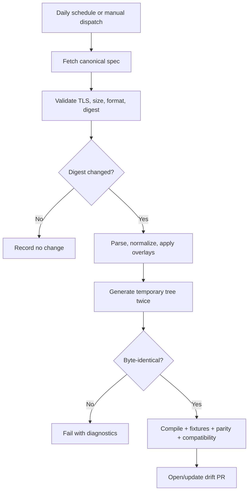
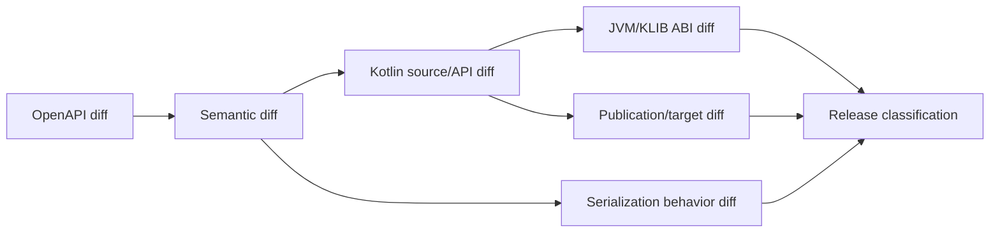

# Specification synchronization and release

## Inputs

Each generated state records:

```json
{
  "source": "https://openrouter.ai/openapi.yaml",
  "sha256": "<digest>",
  "retrievedAt": "<UTC timestamp>",
  "generator": "io.github.nabobery:kotlin-sdkgen:<version>",
  "overlayDigest": "<digest>"
}
```

Network access is not required for ordinary tests. CI tests use pinned inputs.

## Drift workflow



The PR includes source provenance, semantic summary, operation inventory, generated diff, compatibility classifications,
target results, official-SDK comparison, and overlay changes. It does not publish.

## Overlay governance

Every overlay includes:

- Stable identifier.
- Upstream source identity.
- Reason and linked evidence.
- Expected semantic effect.
- Fixture or conformance test.
- Owner and removal condition.

Unused, overlapping, or stale overlays fail validation. An overlay may repair generation metadata but must not quietly
invent server behavior.

## Compatibility review



Official TypeScript, Python, and Go SDK updates are comparison inputs, not generation inputs. Differences in defaults,
headers, resource grouping, stream termination, errors, and retries are reviewed.

## Release stages

| Stage | Purpose | Compatibility |
| --- | --- | --- |
| Alpha | Establish API and gather early feedback | Breaking changes allowed with notes |
| Beta | Complete endpoint and target coverage | Breaks exceptional and classified |
| RC | Prove release, compatibility, security, docs | No planned incompatible change |
| Stable | Production contract | Full compatibility policy |

## Release workflow

1. Select an already reviewed spec/generator state.
2. Run clean generation and assert no diff.
3. Run full test, target, compatibility, security, and documentation gates.
4. Publish to a temporary/isolated repository and compile representative consumers.
5. Generate sources, documentation, POM, signatures, checksums, SBOM, and provenance.
6. Upload the KMP root and all target publications to the Maven Central Portal.
7. Validate the deployment contents.
8. Publish through an explicitly approved protected environment.
9. Verify Central resolution and samples.
10. Publish GitHub release notes and compatibility report.

## Maven Central requirements

The KMP plugin produces a root `kotlinMultiplatform` publication and target-specific publications. Publish each exactly
once under the same version. Include:

- Project name, description, URL, inception year.
- License and developer metadata.
- SCM connections.
- Sources and documentation artifacts.
- Cryptographic signatures and checksums.
- Correct dependency metadata.

Release CI uses Central Portal user tokens and in-memory signing material from protected secrets.

## Version and rollback

- Tags are immutable and match artifact versions.
- Never overwrite a released Maven version.
- A bad release is corrected with a new patch.
- Security incidents may require deprecation/advisory rather than deletion.
- Keep previous spec, generator, overlay, and compatibility inputs reproducible.

## Permissions

Drift and release are separate workflows. Default tokens from PR creation may not trigger expected CI, so use a narrowly
scoped GitHub App or fine-grained token. Release secrets are unavailable to drift and pull-request jobs.

## Release checklist

- [ ] Pinned spec and generator provenance committed
- [ ] Deterministic clean generation
- [ ] No unclassified compatibility change
- [ ] Declared target matrix passed
- [ ] Official SDK parity report reviewed
- [ ] Security and secret-isolation gates passed
- [ ] Isolated consumers resolved all artifacts
- [ ] Documentation examples compiled
- [ ] POM, sources, docs, signatures, SBOM, provenance validated
- [ ] Known limitations and migration notes published

## References

- [KMP publication structure](https://kotlinlang.org/docs/multiplatform-publish-lib.html)
- [KMP Maven Central tutorial](https://kotlinlang.org/docs/multiplatform/multiplatform-publish-libraries.html)
- [OpenRouter API reference](https://openrouter.ai/docs/api/reference/overview)

