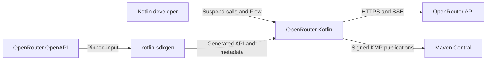
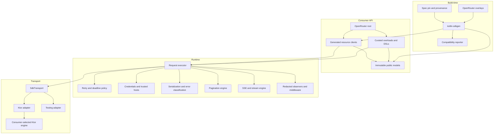
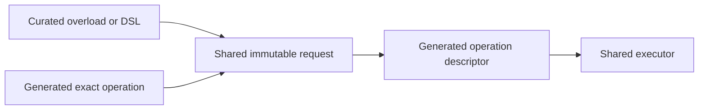
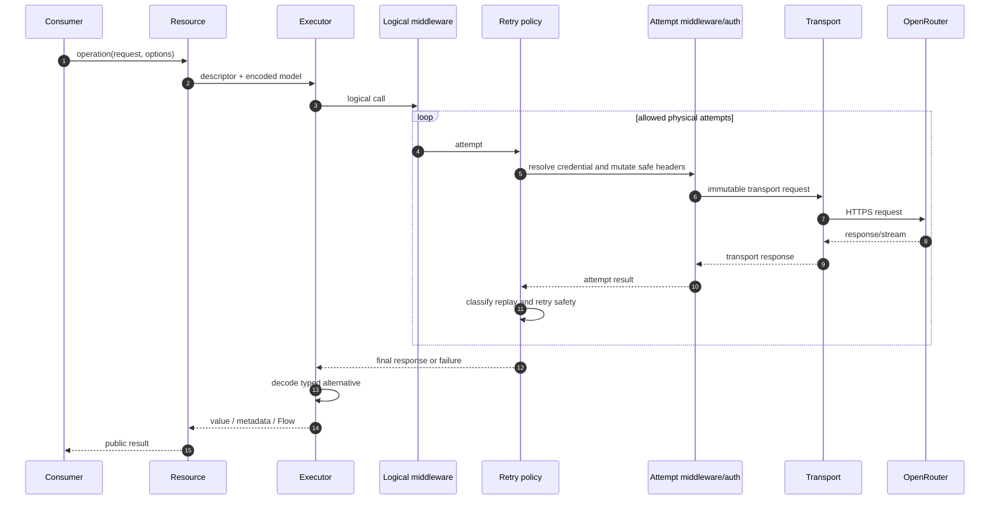
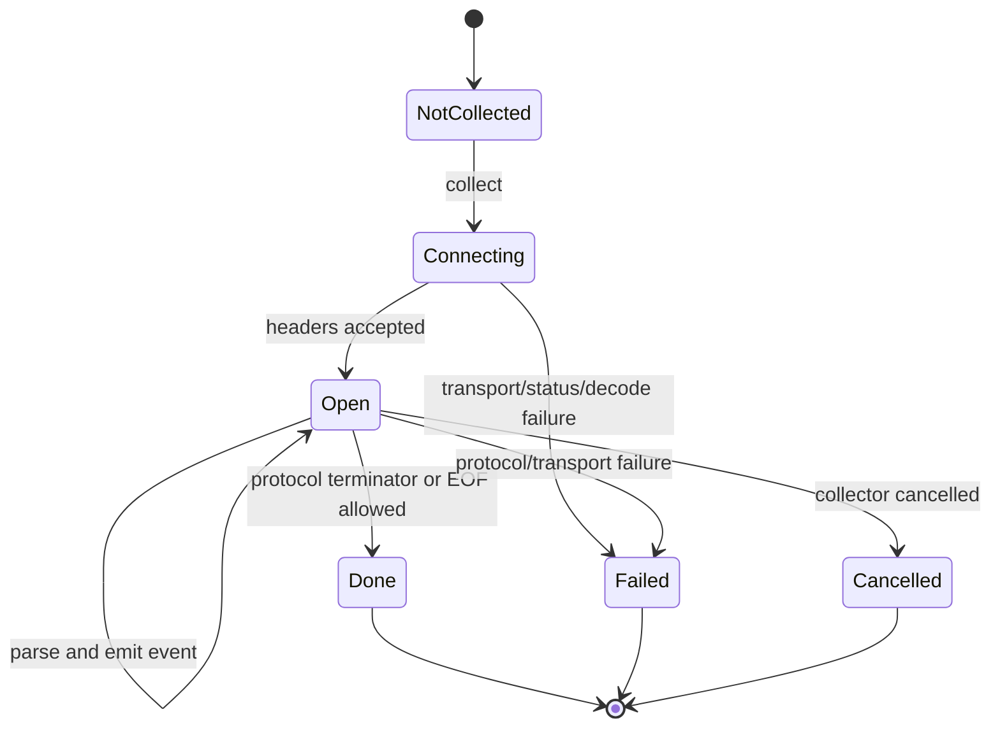
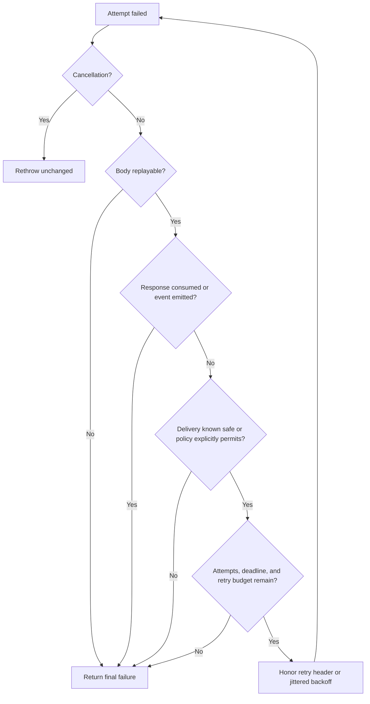
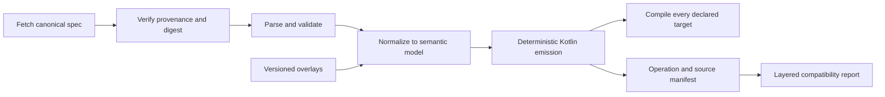

# OpenRouter Kotlin system design

| Field | Value |
| --- | --- |
| Status | Approved for implementation |
| Scope | Generated API, curated Kotlin API, runtime, KMP targets, drift, and publication |
| Last updated | 2026-08-17 |

## 1. Design goals

The architecture must provide complete OpenRouter contract coverage without making routine Kotlin usage feel generated.
It must also keep platform, transport, and generation complexity local to deep modules.

Key invariants:

- The pinned OpenAPI document owns wire names and endpoint shapes.
- Generated and curated calls share models and execution.
- Common public interfaces contain only KMP-compatible types.
- Every physical attempt resolves credentials again.
- Cancellation remains cancellation.
- A consumed response or emitted stream event is never silently replayed.
- Generated code is reproducible and never hand-edited.

## 2. Context



## 3. Module architecture



### Module depth

| Module | Small interface | Hidden implementation complexity | Leverage |
| --- | --- | --- | --- |
| `OpenRouter` | Configuration and resource properties | ownership, defaults, generated wiring | One reusable entry point |
| Resource client | Typed operation methods | encoding, descriptors, status alternatives | Complete discoverable API |
| Executor | Execute descriptor and request | auth, retry, deadlines, classification, cleanup | Consistent behavior everywhere |
| Streaming engine | `Flow<T>` from stream descriptor | incremental SSE, UTF-8, bounds, cancellation | Correct streaming for every endpoint |
| Pagination engine | page/next/pages/items | cursor/link parsing, trusted hosts, limits | Consistent bounded iteration |
| `SdkTransport` | immutable request/response exchange | platform networking | Multiple real adapters at one seam |
| Generator input | spec, overlays, config | normalization, unions, naming, optionality | Deterministic complete SDK |

The deletion test supports these modules: removing an executor, streaming engine, or pagination engine would scatter its
complexity across every generated operation.

## 4. Proposed repository structure

```text
openrouter-kotlin/
├── build-logic/
├── generated/
│   └── commonMain/                 # Recreated by kotlin-sdkgen
├── sdk/
│   ├── src/commonMain/             # Root, curated API, configuration
│   ├── src/commonTest/
│   └── src/<target>Main/
├── testing/
│   ├── src/commonMain/             # Fake transport, fixtures, stream helpers
│   └── src/commonTest/
├── conformance/
│   ├── fixtures/
│   ├── official-sdk-parity/
│   └── consumers/
├── samples/
│   ├── jvm/
│   ├── android/
│   ├── apple/
│   └── web/
├── spec/
│   ├── openrouter.openapi.yaml
│   ├── pin.json
│   └── overlays/
└── docs/
```

Physical Gradle modules may differ from published artifacts. The primary publication can aggregate internal modules
without exposing their separation to consumers.

## 5. Public API layers



The generated layer is complete and mechanically synchronized. The curated layer is intentionally small: it provides
Kotlin-specific semantics or removes high-frequency ceremony. It does not fork the domain model.

## 6. Configuration and dependency injection

`OpenRouter` is a final concrete type. Consumers construct it directly or provide it through their DI container.
Depending on Hilt or Koin would constrain non-Android and non-framework consumers.

```kotlin
val client = OpenRouter(
    credential = CredentialProvider.dynamic { tokenStore.current() },
    httpClient = HttpClient(CIO) {
        // Consumer owns engine, proxy, TLS, and engine timeouts.
    },
)
```

Factories may make DI convenient:

```kotlin
fun provideOpenRouter(httpClient: HttpClient, tokenStore: TokenStore): OpenRouter =
    OpenRouter(
        httpClient = httpClient,
        credential = CredentialProvider.dynamic { tokenStore.current() },
    )
```

Ownership is explicit. A client created around caller-owned Ktor never closes it. An SDK-owned client, if offered by a
platform factory, is closed with `OpenRouter.close()`.

## 7. Request lifecycle



### Ordering

1. Validate local inputs.
2. Apply client defaults and per-request override states.
3. Run logical middleware once.
4. For each attempt, resolve credentials and run attempt middleware.
5. Apply trusted-host and reserved-header rules.
6. Execute transport.
7. Classify status/transport outcome and retry eligibility.
8. Decode the selected response alternative.
9. Close or transfer body ownership exactly once.
10. Emit redacted terminal observation.

## 8. Override model

Nullable values cannot distinguish inherit, clear, and replace. Public convenience methods map to an internal tri-state:

```kotlin
sealed interface Override<out T> {
    data object Inherit : Override<Nothing>
    data object Clear : Override<Nothing>
    data class Replace<T>(val value: T) : Override<T>
}
```

Routine users see named methods such as `clearAttribution()` rather than manipulating the internal state type directly.

## 9. Streaming



The stream engine reads incremental byte chunks, performs streaming UTF-8 decoding, recognizes SSE boundaries, and
decodes the generated payload union. Diagnostic retention is last-N or byte-bounded. The collecting coroutine owns the
session; cancellation closes upstream I/O. `Flow` is returned, not implemented through a custom third-party subtype.

## 10. Failure model

```text
SdkException
├── ConfigurationException
├── AuthenticationException
├── TransportException
├── TimeoutException
├── ApiException<TError>
├── SerializationException
├── StreamProtocolException
└── UnexpectedResponseException
```

Generated operations can expose decoded error alternatives through `ApiException`. Unknown or malformed bodies use a
bounded redacted preview. Exception messages are useful but not stable machine contracts; callers use typed fields.

## 11. Retry and deadline model



Total deadline includes retries and delays. Attempt deadline covers one exchange. Stream-idle measures time between
progress signals. Connect/socket values are engine configuration and are documented alongside target setup.

## 12. Pagination

The engine supports descriptor-driven cursor, next-link, and future strategies. Following absolute URLs requires a
trusted-host check before authentication is attached.

```kotlin
val first = client.models.list()
val second = first.next()
client.models.listPages().collect(::persistPage)
client.models.listItems().collect(::indexModel)
```

Automatic flows accept page/item limits to make request amplification explicit.

## 13. Generation architecture



`kotlin-sdkgen` provides resource partitioning, typed errors, open enums, field-state handling, replay-aware runtime
primitives, and multiple transport adapters. Version 0.2.0 added dual JSON/SSE response generation (activated for the
OpenRouter spec via the overlay-injected `x-sdkgen-streaming` extension) and the `offsetLimit` pagination style used
by most OpenRouter list operations. Version 0.3.0 reaches 89/89 operation coverage. OpenRouter Kotlin owns only
OpenRouter-specific overlays and the curated facade.

## 14. Target architecture

Common code owns all product behavior. Platform source sets are permitted only for environment credentials, platform
metadata, and unavoidable integrations. Engine selection remains in consumer code. See [target support](./target-support.md).

## 15. Observability

Observers see immutable lifecycle events after redaction. Logical hooks run once; attempt hooks run per retry. Middleware
can affect behavior and is therefore a separate, explicitly dangerous extension from observers.

No SDK log output exists by default.

## 16. Security model

Trust is established separately for:

- Spec acquisition.
- Authentication host attachment.
- Redirect and pagination target following.
- Consumer-supplied middleware.
- Generated artifact provenance.

Details are normative in [security and privacy](./security-and-privacy.md).

## 17. Publication

One version produces a KMP root module and target-specific variants. A release build runs on capable hosts, signs all
publications, generates sources/documentation, validates isolated resolution, produces SBOM/provenance, and uploads
through the Maven Central Portal. Schema drift is a separate workflow.

## 18. Alternatives rejected

| Alternative | Reason |
| --- | --- |
| Retrofit core | JVM/Android only; does not consume OpenAPI itself |
| Stock generated Ktor client | Insufficient OpenRouter union, naming, optionality, and streaming quality |
| Fully handwritten SDK | Unsustainable endpoint/schema drift |
| Separate raw client | Duplicates configuration and encourages layer divergence |
| Bundled engines | Imposes target dependencies and engine policy |
| Many resource artifacts | Increases version skew and consumer complexity before proven need |
| DI framework dependency | Excludes or burdens consumers; constructor/factory injection is sufficient |

## 19. References

- [Product requirements](./product-requirements.md)
- [Public API design](./public-api-design.md)
- [Ktor SSE](https://ktor.io/docs/client-server-sent-events.html)
- [Kotlin Flow](https://kotlinlang.org/api/kotlinx.coroutines/kotlinx-coroutines-core/kotlinx.coroutines.flow/-flow/)
- [OpenRouter SDK overview](https://openrouter.ai/docs/client-sdks/overview)
- [kotlin-sdkgen](https://github.com/nabobery/kotlin-sdkgen)
