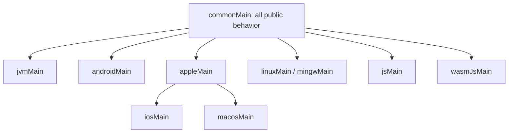

# Kotlin Multiplatform target support

## Policy

OpenRouter Kotlin publishes for actively maintained Kotlin target families that are materially useful for an HTTP client.
Support is tiered by evidence, not marketing language.

## Target matrix (evidence-based)

The tier assignments are decided in [ADR 0007](adr/0007-final-target-tiers-for-1-0.md); this table is the evidence
mirror. **Compile** = the declared target compiles (from any host for native; Apple only on macOS). **klib ABI** =
`apiCheck` validates the klib dump. **Common** / **Engine** = the fake-transport common suites / the real-Ktor
`MockEngine` `engineTest` lane run on that target (`engineTest` runs on every lane via the `runRealTime` harness).
The streaming lane is no longer compile-only anywhere a host runner exists.

| Target | Tier | Compile | klib ABI | Common suites | Engine (`engineTest`) | Runtime lane | Sample |
| --- | --- | --- | --- | --- | --- | --- | --- |
| `jvm` | 1 | ✅ | JVM ABI | ✅ | ✅ | `jvmTest` (PR) | jvm (CIO) |
| `android` | 1 | ✅ | JVM ABI (`api/jvm`) | ✅ | — (host lane runs common) | `testAndroidHostTest` (PR); **device tests not run** | android (OkHttp) |
| `macosArm64` | 1 | ✅ | ✅ | ✅ | ✅ | `macosArm64Test` (PR) | apple (Darwin) |
| `iosSimulatorArm64` | 1 | ✅ | ✅ | ✅ | ✅ | `iosSimulatorArm64Test` (PR, macos-15) | ios (Swift/XCFramework) |
| `iosArm64` | 1 | ✅ | ✅ | — | — | **device — not executed** | ios (Swift/XCFramework) |
| `linuxX64` | 2 | ✅ | ✅ | ✅ | ✅ | `linuxX64Test` (PR, ubuntu) | native-desktop (CIO) |
| `linuxArm64` | 2 | ✅ | ✅ | ✅ | ✅ | `linuxArm64Test` (PR, ubuntu-24.04-arm) | native-desktop (CIO) |
| `mingwX64` | 2 | ✅ | ✅ | ✅ | ✅ | `mingwX64Test` (PR, windows) | native-desktop (WinHttp) |
| `js` (Node) | 2 | ✅ | ✅ | ✅ | ✅ | `jsNodeTest` (PR) | js (Js) |
| `js` (browser) | 2 | ✅ | ✅ | ✅ | ✅ | `jsBrowserTest` (PR, headless Chrome) | browser (Js) |
| `macosX64` | 2 (deprecated) | ✅ | ✅ | ✅ | ✅ | `macosX64Test` (**nightly**, macos-15-intel) | — |
| `iosX64` | 2 (deprecated) | ✅ | ✅ | ✅ | ✅ | `iosX64Test` (**nightly**, macos-15-intel) | — |
| `wasmJs` | 3 | ❌ blocked upstream | — | — | — | `scripts/wasm-probe.sh` (fails until runtime ships wasmJs) | — |

### Not executed (explicit disclosure)

- **iOS device** (`iosArm64`) runtime: no device farm — the simulator lane (`iosSimulatorArm64`) is the iOS runtime
  evidence.
- **Android device** tests: no emulator in CI — the JVM-hosted `testAndroidHostTest` lane is the Android runtime
  evidence.
- **`wasmJs`**: cannot compile because the kotlin-sdkgen runtime publishes no wasmJs variant.
- **watchOS / tvOS / `androidNative*` / `linuxArm32Hfp` / wasmWasi**: not declared targets (no runtime artifacts or
  no HTTP-client value).

`macosX64` and `iosX64` are deprecated upstream since Kotlin 2.3.20 (they still compile); they run compile + klib ABI
on PRs and their runtime lanes nightly on `macos-15-intel`, and retire when Kotlin removes them.

Engine choices per target are documented in [`samples/README.md`](../samples/README.md) (the one-sample-per-engine
table); the policy below links to it rather than duplicating it.

## Engine policy

The SDK depends on Ktor client core but does not impose a target engine. Consumers select one, for example:

| Target | Common engine choices | Ownership |
| --- | --- | --- |
| JVM/server | CIO, Java, OkHttp | Consumer |
| Android | OkHttp, CIO, Android | Consumer |
| Apple | Darwin | Consumer |
| Linux | CIO, Curl | Consumer |
| Windows | WinHTTP, CIO where supported | Consumer |
| JS/Wasm | JavaScript/fetch engine | Consumer |

The documentation will show an example, not declare one universal default.

## Source-set rules

- Models, resources, serialization, errors, retries, pagination, and stream framing belong in `commonMain`.
- Platform source sets contain only unavoidable environment or integration code.
- No `expect/actual` is introduced until at least two real implementations justify the seam.
- Ktor engines stay in consuming applications and samples.

## Host constraints

Compilation and testing may require multiple CI hosts. Apple runtime tests execute on macOS. Windows-specific runtime
tests execute on Windows. Linux Native tests execute on Linux. Publication orchestration must prevent duplicate root
publication while collecting artifacts produced on different hosts.

## Promotion criteria

A target moves up a tier when:

- Its engine and Kotlin target are actively maintained.
- A real sample consumer builds.
- Streaming, cancellation, serialization, and TLS behavior pass.
- CI is reliable for three consecutive release cycles.
- At least one maintainer or meaningful consumer can support failures.

## Retirement criteria

Retirement requires:

1. A public deprecation notice.
2. At least one minor release of overlap when feasible.
3. A replacement/workaround.
4. A compatibility-policy entry and release note.

Security or upstream Kotlin removal may require accelerated retirement.

## Claims

Use precise wording:

- “Published” means an artifact exists.
- “Compiles” means the declared target compiles.
- “Tested” means the documented suite runs on that target.
- “Stable” means compatibility guarantees apply.

Do not use “supports all KMP targets” without linking to this matrix.

## References

- [KMP target hierarchy](https://kotlinlang.org/docs/multiplatform-hierarchy.html)
- [KMP library publication](https://kotlinlang.org/docs/multiplatform-publish-lib.html)
- [Ktor client engines](https://ktor.io/docs/client-engines.html)
