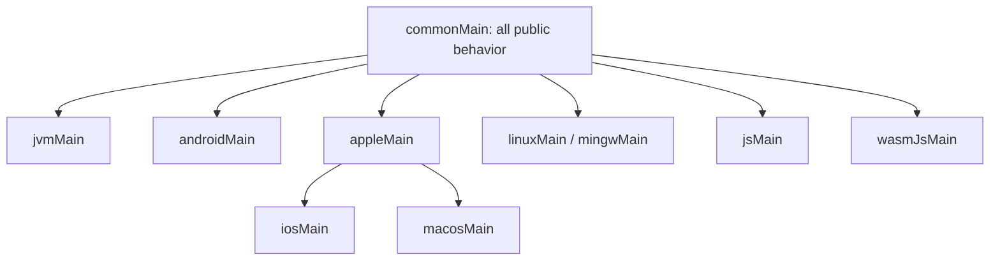

# Kotlin Multiplatform target support

## Policy

OpenRouter Kotlin publishes for actively maintained Kotlin target families that are materially useful for an HTTP client.
Support is tiered by evidence, not marketing language.

## Initial target-family matrix

| Tier | Target families | Required evidence |
| --- | --- | --- |
| 1 | JVM, Android, iOS (`iosArm64`, `iosSimulatorArm64`, `iosX64`), macOS (`macosArm64`, `macosX64`) | Compile, API validation, shared contract tests, Ktor transport tests, sample consumer |
| 2 | Linux (`linuxX64`, `linuxArm64`), Windows (`mingwX64`), JS browser and Node.js | Compile, API/serialization tests, selected transport tests, smoke consumer |
| 3 | Wasm JS and other actively maintained Kotlin targets with viable Ktor support | Compile and focused compatibility tests; experimental label |

The exact Gradle target list is validated against the selected Kotlin and Ktor versions. A target is not
published merely because Kotlin can declare it; HTTP engine availability and consumer value must exist.

Generator dependency note: `kotlin-sdkgen` 0.1.0 published its runtime for arm64 Apple targets only. Version 0.2.0
added `iosX64` and `macosX64`, and this matrix's Tier 1 builds against them. Wasm JS is not yet a generator runtime
target and stays Tier 3/experimental.

## Engine policy

The SDK depends on Ktor client core but does not impose a target engine. Consumers select one, for example:

| Target | Common engine choices | Ownership |
| --- | --- | --- |
| JVM/server | CIO, Java, OkHttp | Consumer |
| Android | OkHttp, CIO, Android | Consumer |
| Apple | Darwin | Consumer |
| Linux | CIO, Curl | Consumer |
| Windows | WinHTTP, CIO where supported | Consumer |
| JS/Wasm | JavaScript/fetch engine | Consumer |

The documentation will show an example, not declare one universal default.

## Source-set rules

- Models, resources, serialization, errors, retries, pagination, and stream framing belong in `commonMain`.
- Platform source sets contain only unavoidable environment or integration code.
- No `expect/actual` is introduced until at least two real implementations justify the seam.
- Ktor engines stay in consuming applications and samples.

## Host constraints

Compilation and testing may require multiple CI hosts. Apple runtime tests execute on macOS. Windows-specific runtime
tests execute on Windows. Linux Native tests execute on Linux. Publication orchestration must prevent duplicate root
publication while collecting artifacts produced on different hosts.

## Promotion criteria

A target moves up a tier when:

- Its engine and Kotlin target are actively maintained.
- A real sample consumer builds.
- Streaming, cancellation, serialization, and TLS behavior pass.
- CI is reliable for three consecutive release cycles.
- At least one maintainer or meaningful consumer can support failures.

## Retirement criteria

Retirement requires:

1. A public deprecation notice.
2. At least one minor release of overlap when feasible.
3. A replacement/workaround.
4. A compatibility-policy entry and release note.

Security or upstream Kotlin removal may require accelerated retirement.

## Claims

Use precise wording:

- “Published” means an artifact exists.
- “Compiles” means the declared target compiles.
- “Tested” means the documented suite runs on that target.
- “Stable” means compatibility guarantees apply.

Do not use “supports all KMP targets” without linking to this matrix.

## References

- [KMP target hierarchy](https://kotlinlang.org/docs/multiplatform-hierarchy.html)
- [KMP library publication](https://kotlinlang.org/docs/multiplatform-publish-lib.html)
- [Ktor client engines](https://ktor.io/docs/client-engines.html)
