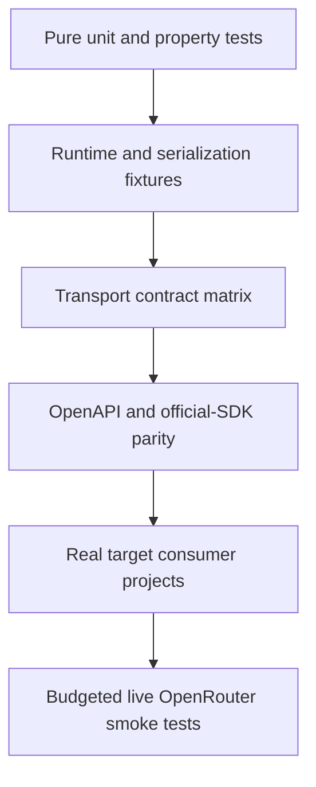
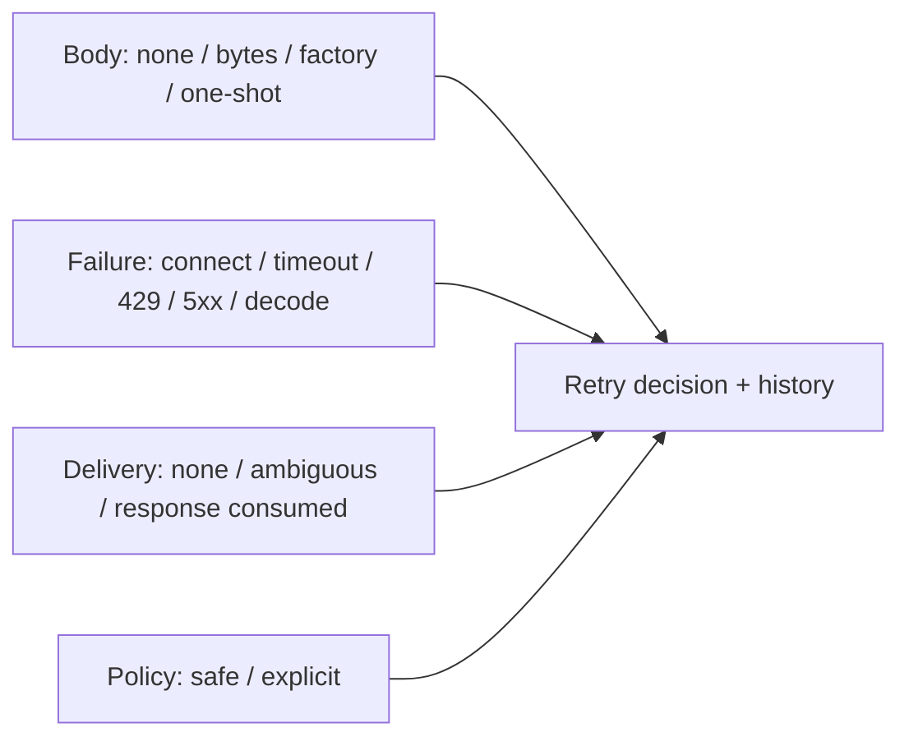

# Testing strategy

## Objectives

Tests prove contract fidelity, Kotlin usability, transport correctness, target portability, and safe release behavior.
Generated line coverage alone is not a useful quality measure.

## Test pyramid

## Layers

| Layer | Runs | Purpose |
| --- | --- | --- |
| Pure unit | Every PR | Naming, overrides, retry decisions, header rules, parsing primitives |
| Schema fixtures | Every PR | Unions, open enums, optional/null, unknown fields, formats |
| Runtime contract | Every PR | auth, ownership, middleware, deadlines, failures, pagination, streaming |
| Ktor/fake adapter kit | Every PR | Identical transport semantics and cancellation |
| Generated OpenRouter consumer | Every PR | Exact API compiles and representative calls encode/decode |
| Target compile/API matrix | Every PR or merge queue | Published declarations work across targets |
| Runtime target matrix | Merge/nightly by tier | Engine-specific behavior |
| Official SDK parity | PR (offline freshness) + weekly refresh | Operation matrix and curated behaviour rows vs the pinned official TS/Py/Go inventories — see `docs/parity/official-sdk-parity.md` |
| Live smoke | Nightly/release, budgeted | Detect server/spec behavior drift |
| Isolated publication consumer | Release | Maven metadata and target resolution |

## Streaming matrix

Test:

- One event per network chunk and many events in one chunk.
- Delimiter and UTF-8 code point split across chunks.
- CRLF, LF, comments, blank fields, multiline `data`, `id`, and `retry`.
- Metadata-only events and `[DONE]`.
- Typed in-band error event.
- Non-2xx before stream establishment.
- Malformed event after valid events.
- EOF with and without required terminator.
- Collector cancellation before headers, after first event, and during suspended emission.
- Slow consumer backpressure.
- Bounded diagnostic buffer after a large stream.
- No retry after the first emitted event.

The first-event test uses a server/fake that does not complete until the assertion observes the first emission, proving
the implementation is incremental.

### Inference and streaming suites

The inference and streaming surface realizes the matrix above as these suites. The common suites run on every host
lane and `engineTest` (the shared real-Ktor source set) runs on every lane too via the `runRealTime`
harness (see the target matrix below). Full-suite counts: JVM 188 and macosArm64 181 — all passing (per-lane counts
in [`target-support.md`](target-support.md)).

| Suite | Lane | Contracts covered |
| --- | --- | --- |
| `StreamingWireTruthTest` | commonTest (JVM + macOS) | 4 wire-truth decode tests — chat / responses / messages / images payloads decode (RED before the SSE payload overlay, GREEN after) |
| `ChatStreamingFramingTest` | commonTest (JVM + macOS) | 14 framing rows — one-event-per-chunk & many-in-one, delimiter split across chunks, UTF-8 codepoint split, CRLF, comments/retry/id/blank ignored, multiline `data` joined, metadata-only skipped, `[DONE]` ends without emission, EOF completes, usage-only final chunk, non-success → typed `ApiException`, malformed → bounded `SdkSerializationException`, event over byte budget → `SdkStreamingException`, unknown finish reason preserved |
| `ChatStreamingLifecycleTest` | commonTest (all lanes) | 14 lifecycle rows — first event before response completes, cancellation before headers, cancellation after first event closes body with `CancellationException`, `take(1)` closes upstream, downstream failure closes upstream with same cause, backpressure, stream-idle deadline (STREAM_IDLE phase), **stream-idle deadline applies with no `options()`** (client deadline inherited through `SdkClientConfig`), **streaming never retried even pre-first-byte**, no retry after emission, two collections start two requests, attribution + options headers reach stream requests, secret never leaks in failures, large (10k-event) stream decodes incrementally to completion |
| `KtorStreamingEngineTest` | engineTest (JVM + macOS, real Ktor MockEngine) | 5 rows — multiple events + `[DONE]` decode, cancellation closes the engine response, mid-stream error as value, comments + `[DONE]`, stream-idle deadline fires |
| `InferenceStreamingContractTest` | commonTest (JVM + macOS) | Responses & Messages golden payload identity, typed events + text deltas, messages typed error-as-value with `errorType`, idle deadline, cancellation |
| `LiveChatSmokeTest` | jvmTest (opt-in) | Gated by `OPENROUTER_LIVE_TESTS=1` + `OPENROUTER_API_KEY`; 2 requests; nightly `.github/workflows/live.yml` |

> **MockEngine caveat:** Ktor's `MockEngine` buffers a streaming body until the producer closes, so "first event before
> body completes" and mid-stream cancellation observation are proven on the fake transport (and the upstream
> transport-ktor conformance suite), not in `KtorStreamingEngineTest`.

> **Streaming is never retried.** kotlin-sdkgen 0.4.0 disables retry **entirely** for the streaming response mode
> (`SdkExecutor.kt`: `retry ... .takeUnless { responseMode == STREAMING }`). No streaming op is retried — not even a
> pre-first-byte 429, which surfaces immediately as the typed `ApiException`. This is stricter and safer than the
> buffered path (which retries an allowlisted 429), because an opened stream cannot be transparently restarted; it
> supersedes any earlier plan assumption that pre-first-byte stream retry is allowed. Pinned by the "streaming never
> retried" rows of `ChatStreamingLifecycleTest`. See also the "no retry after emission" bullet under **Retry matrix**.

## Retry matrix

Use virtual time and injected clock/random sources. Assert delay selection, retry headers, total deadline, attempt count,
credential refresh, and exact final exception history.

## Cancellation

- Use `runTest` for common coroutine behavior.
- Do not catch broad `Exception` without asserting `CancellationException` rethrow.
- Assert transport close/cancel, not only Flow completion.
- Test cancellation races at ownership-transfer points.
- Avoid real delay in deterministic suites.

## Serialization

Golden fixtures cover:

- Known and unknown open enums.
- Known and unknown discriminator variants.
- Optional non-null, required nullable, optional nullable.
- Large numeric values and precision-sensitive cost fields.
- Arbitrary nested `JsonObject`.
- Typed error alternatives.
- Deprecated aliases.
- Round trip only where round trip is a documented property.

## Pagination

Assert manual next-page calls, page/item flows, limits, empty pages, repeated cursors, malformed links, relative URLs,
untrusted absolute hosts, cancellation, and failure after earlier pages. Automatic pagination must expose request bounds.

## Security tests

- Secret values never appear in `toString`, snapshots, exceptions, observer events, or build logs.
- Header names are case-insensitively protected.
- Authentication is not forwarded on redirects or pagination to untrusted hosts.
- Error previews are byte-bounded and redacted.
- Spec acquisition verifies digest.
- Before publication, resolve the complete publication graph with dependency verification enabled.

## Target matrix

The per-target evidence matrix and its CI lanes are in [`target-support.md`](target-support.md) (mirroring
[ADR 0007](adr/0007-final-target-tiers-for-1-0.md)). The real-Ktor `engineTest` lane runs on **every**
host test lane via the `runRealTime` harness (`runTest` + `Dispatchers.Default`, real time — the cross-platform
replacement for `runBlocking`, which JS lacks), so no target is streaming compile-only where a host runner exists:

- **PR CI:** `jvmTest`, `jsNodeTest`, `jsBrowserTest` (headless Chrome), `testAndroidHostTest`, `linuxX64Test`
  (ubuntu), `linuxArm64Test` (ubuntu-24.04-arm), `mingwX64Test` (windows), `macosArm64Test` + `iosSimulatorArm64Test`
  (macos-15) — each running the common **and** `engineTest` suites.
- **Nightly:** `macosX64Test` + `iosX64Test` on `macos-15-intel`; the benchmark suite (`perf.yml`).
- **Not executed (disclosed):** iOS device (`iosArm64`), Android device tests, `wasmJs` (blocked upstream). These are
  reported as explicit limitations in `target-support.md`, never silently counted as passes.

## Live test controls

- Use a dedicated, least-privileged key.
- Enforce daily request/token/cost budgets.
- Use inexpensive models and deterministic prompts where possible.
- Never run live tests for fork pull requests.
- Redact all payload and credential data.
- Treat provider variability separately from SDK failure.

## Release evidence

A release candidate stores:

- Pinned inputs and digests.
- Generator and dependency versions.
- Test and target matrices.
- Compatibility reports.
- Official SDK parity report.
- Publication rehearsal output.
- SBOM, signatures, and provenance.
- Known limitations and accepted waivers.

## Machine-checked CI gates

Beyond the test lanes, offline gates keep tooling, docs, and security invariants honest (each a stdlib-only Python
script with a `_test.py` companion, run on `build-linux`):

| Gate | Script | Enforces |
| --- | --- | --- |
| Drift | `check-drift.sh` | regeneration reproduces the committed baseline (content address + file counts) |
| Coverage dashboard | `coverage-dashboard.py` | `docs/coverage/operation-coverage.md` is fresh |
| Workflow secret isolation | `workflow-audit.py` | SHA-pinned actions, least-privilege permissions, no artifact-derived execution in write jobs |
| Compatibility | `compat-report.py` (+ `compat.yml`) | layered OpenAPI→semantic→source→ABI→wire→behaviour→targets classification; fail on unclassified, `compat:breaking` label rule |
| Official-SDK parity | `parity-matrix.py` | the generated matrix matches the pinned TS/Py/Go inventories |
| Compiled-guide snippets | `docs-snippets.py` | every guide example matches its compiled `:samples:docs` region |
| Docs-vs-code consistency | `docs-consistency.py` | targets, default constants, spec pins, and coverage totals agree |
| KDoc completeness | `kdoc-audit.py` | every public curated symbol has KDoc |
| Budgets | `budgets.py` | artifact size, compile time, warning count (0), runtime latency/throughput |

## Acceptance gates

- No ignored failing test without an owner and expiry.
- No flaky retry as a substitute for fixing deterministic tests.
- Generated code is excluded from percentage targets but covered through contract/conformance evidence.
- Handwritten critical behavior has branch-focused tests.
- All public examples compile.
