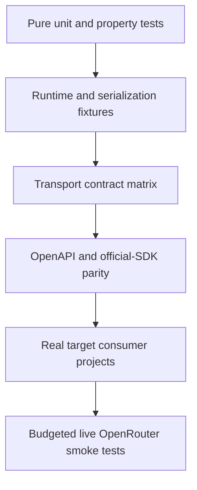
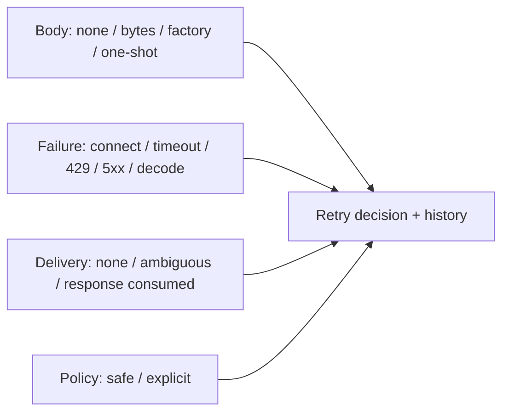

# Testing strategy

## Objectives

Tests prove contract fidelity, Kotlin usability, transport correctness, target portability, and safe release behavior.
Generated line coverage alone is not a useful quality measure.

## Test pyramid

## Layers

| Layer | Runs | Purpose |
| --- | --- | --- |
| Pure unit | Every PR | Naming, overrides, retry decisions, header rules, parsing primitives |
| Schema fixtures | Every PR | Unions, open enums, optional/null, unknown fields, formats |
| Runtime contract | Every PR | auth, ownership, middleware, deadlines, failures, pagination, streaming |
| Ktor/fake adapter kit | Every PR | Identical transport semantics and cancellation |
| Generated OpenRouter consumer | Every PR | Exact API compiles and representative calls encode/decode |
| Target compile/API matrix | Every PR or merge queue | Published declarations work across targets |
| Runtime target matrix | Merge/nightly by tier | Engine-specific behavior |
| Official SDK parity | Scheduled and release | Defaults, operations, errors, headers, stream fixtures |
| Live smoke | Nightly/release, budgeted | Detect server/spec behavior drift |
| Isolated publication consumer | Release | Maven metadata and target resolution |

## Streaming matrix

Test:

- One event per network chunk and many events in one chunk.
- Delimiter and UTF-8 code point split across chunks.
- CRLF, LF, comments, blank fields, multiline `data`, `id`, and `retry`.
- Metadata-only events and `[DONE]`.
- Typed in-band error event.
- Non-2xx before stream establishment.
- Malformed event after valid events.
- EOF with and without required terminator.
- Collector cancellation before headers, after first event, and during suspended emission.
- Slow consumer backpressure.
- Bounded diagnostic buffer after a large stream.
- No retry after the first emitted event.

The first-event test uses a server/fake that does not complete until the assertion observes the first emission, proving
the implementation is incremental.

## Retry matrix

Use virtual time and injected clock/random sources. Assert delay selection, retry headers, total deadline, attempt count,
credential refresh, and exact final exception history.

## Cancellation

- Use `runTest` for common coroutine behavior.
- Do not catch broad `Exception` without asserting `CancellationException` rethrow.
- Assert transport close/cancel, not only Flow completion.
- Test cancellation races at ownership-transfer points.
- Avoid real delay in deterministic suites.

## Serialization

Golden fixtures cover:

- Known and unknown open enums.
- Known and unknown discriminator variants.
- Optional non-null, required nullable, optional nullable.
- Large numeric values and precision-sensitive cost fields.
- Arbitrary nested `JsonObject`.
- Typed error alternatives.
- Deprecated aliases.
- Round trip only where round trip is a documented property.

## Pagination

Assert manual next-page calls, page/item flows, limits, empty pages, repeated cursors, malformed links, relative URLs,
untrusted absolute hosts, cancellation, and failure after earlier pages. Automatic pagination must expose request bounds.

## Security tests

- Secret values never appear in `toString`, snapshots, exceptions, observer events, or build logs.
- Header names are case-insensitively protected.
- Authentication is not forwarded on redirects or pagination to untrusted hosts.
- Error previews are byte-bounded and redacted.
- Spec acquisition verifies digest.
- Publication resolves with dependency verification enabled.

## Target matrix

Tier 1 targets run common contracts and at least one Ktor engine integration. Tier 2 targets run common contracts where
hosted and selected smoke tests. Tier 3 must compile and pass focused serialization/API checks before publication.

Host-unavailable tests are reported as explicit matrix limitations, never silently counted as passes.

## Live test controls

- Use a dedicated, least-privileged key.
- Enforce daily request/token/cost budgets.
- Use inexpensive models and deterministic prompts where possible.
- Never run live tests for fork pull requests.
- Redact all payload and credential data.
- Treat provider variability separately from SDK failure.

## Release evidence

A release candidate stores:

- Pinned inputs and digests.
- Generator and dependency versions.
- Test and target matrices.
- Compatibility reports.
- Official SDK parity report.
- Publication rehearsal output.
- SBOM, signatures, and provenance.
- Known limitations and accepted waivers.

## Acceptance gates

- No ignored failing test without an owner and expiry.
- No flaky retry as a substitute for fixing deterministic tests.
- Generated code is excluded from percentage targets but covered through contract/conformance evidence.
- Handwritten critical behavior has branch-focused tests.
- All public examples compile.

